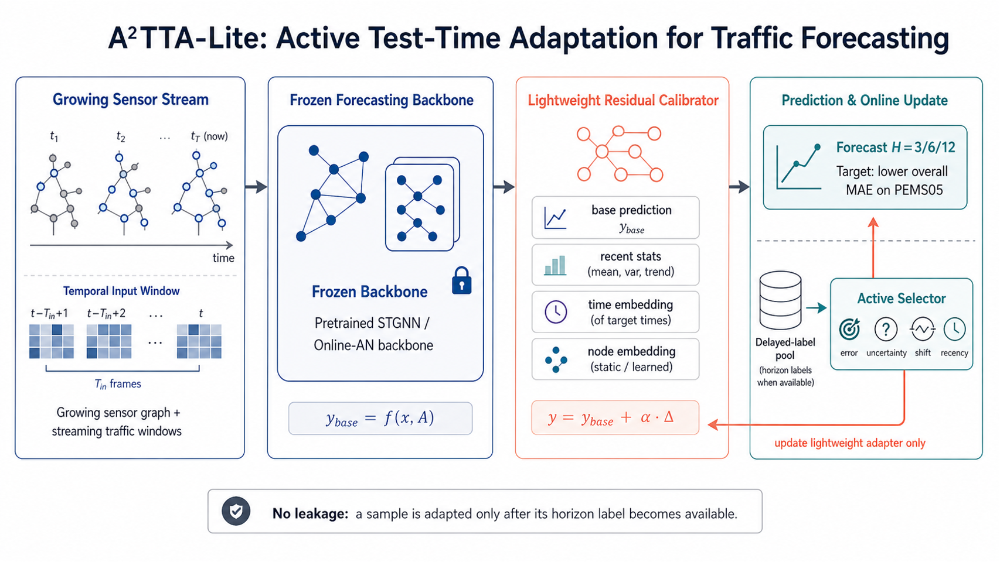

<div align="center">
  <h2><b>A2TTA: Active Adaptive Test-Time Adaptation <br> for Continual Traffic Forecasting under Extreme Sensor Growth</b></h2>
</div>

<div align="center">

[](http://makeapullrequest.com)
[](./LICENSE)

</div>

> **TL;DR.** Existing evolving-graph continual forecasters degrade sharply when the sensor
> network grows by orders of magnitude over its lifetime (e.g. **+9433%** on PEMS05). A2TTA
> keeps a **frozen backbone** and attaches a tiny **zero-init residual calibrator** that is
> adapted **at test time** using **delayed ground-truth labels** and **active sample
> selection** — recovering accuracy at a fraction of the cost of retraining.

<p align="center">
  
</p>

---

## 📖 Method

A2TTA decouples *what the model knows* (a frozen backbone) from *how it adapts on the fly*
(a lightweight calibrator), so adaptation cost stays constant even as the graph explodes.

1. **Frozen backbone.** A per-year STGNN checkpoint (by default the **Online-AN** backbone)
   is loaded and frozen — no backbone gradients are ever computed at test time.

2. **Residual calibrator** ([`src/model/a2tta.py`](src/model/a2tta.py)). A small per-node
   MLP that consumes the backbone prediction `y_base`, the input window `x_in`, four
   temporal statistics (last / mean / std / OLS-slope), and a learnable per-node embedding,
   and emits a **zero-initialized residual** `Δ`:
   `y = y_base + softplus(scale) · Δ`.
   Because the output projection is zero-init, the calibrator starts as an identity — it can
   only *help* a well-trained backbone, never hurt it before adaptation. The node embedding
   **grows automatically** as new sensors appear year over year.

3. **Delayed-label online adaptation** ([`src/trainer/a2tta_trainer.py`](src/trainer/a2tta_trainer.py)).
   Test windows are processed in **true chronological order**. A window's ground truth is
   only revealed after its forecast horizon `H` has physically elapsed — enforced by a
   `pending → candidate_pool` queue, so **no label leakage** is possible. Every few batches we:
   - **score** the candidate pool with an `ActiveSelector` — a weighted blend of recent
     error, MC-dropout uncertainty, distribution-shift, and recency;
   - **select** the top `budget_frac` of candidates;
   - take a few gradient steps on the **calibrator only** (supervised L1 + a weak consistency
     loss + a proximal anchor to the init).

4. **Identical metrics.** Predictions are scored with the same `cal_metric` used by every
   baseline, so A2TTA numbers are directly comparable to Online-AN / EAC / etc.

### Ablation variants (the `--method` flag)

| `--method`   | Description |
|--------------|-------------|
| `backbone`   | frozen backbone, no calibrator (lower bound) |
| `calibrator` | warmed-up calibrator, **no** online TTA |
| `tta_random` | online TTA, random sample selection |
| `tta_recent` | online TTA, most-recent selection |
| `tta_error`  | online TTA, error-only selection |
| `a2tta_lite` | **full active selection** (err + unc + shift + recency) — *our method* |
| `tta_all`    | online TTA over the full pool, no selection (compute upper bound) |

---

## 📦 Repository layout

```
a2tta/
├── main.py                 # entry for all backbones / continual baselines
├── a2tta_main.py           # entry for A2TTA (+ its ablation variants)
├── stkec_main.py           # entry for STKEC
├── src/
│   ├── model/              # model.py (all backbones+baselines), a2tta.py, ewc.py, replay.py, ...
│   ├── trainer/            # default_trainer.py, a2tta_trainer.py, stkec_trainer.py
│   └── dataer/             # SpatioTemporalDataset.py
├── utils/                  # data_convert, initialize, metric, common_tools
├── conf/                   # per-dataset JSON configs (PEMS, pems03 … pems12)
├── scripts/                # one-command runners for A2TTA + every baseline
├── data/                   # dataset skeleton + processing notebooks (see data/README.md)
└── environment.yaml
```

---

## 🚀 Getting started

### 1. Environment

```bash
conda env create -f environment.yaml
conda activate stg
```

Core dependencies: `python`, `pytorch`, `torch-geometric`, `networkx`, `scipy`, `numpy`,
`tqdm`. A single CUDA GPU is enough; CPU works for debugging (`--gpuid -1`).

### 2. Data

The processed tensors are large and are released separately — see
**[`data/README.md`](data/README.md)**

> ☁️ **Cloud-disk download link:** `https://pan.baidu.com/s/1llz16kYY33TrWlKENNHC5A?pwd=xxtf code: xxtf`
> ☁️ **Raw data Link:**   `https://pan.baidu.com/s/1BPuxL96npWlfRXDv38duww?pwd=xxtf code: xxtf`

Place them under `data/<dataset>/{RawData,FastData,graph}/`; the configs already point there.
Datasets: **XXL expanding-sensor** benchmarks
`pems03 … pems12` (2005–2025), where the sensor count grows by up to two orders of magnitude.

---

## 🏃 Running A2TTA

> **Prerequisite.** A2TTA adapts on top of a *frozen per-year backbone*. By default it loads
> the **Online-AN** checkpoints. Make sure you have run the Online-AN stage for the dataset
> first (it is step 5 of every `scripts/pemsXX_run.sh`; for PEMS05 you can also run
> `python main.py --conf conf/PEMS05/oneline_st_an_pems05.json --gpuid 0 --seed 51`).

**Single run** (PEMS05, full method, one seed):

```bash
python a2tta_main.py \
    --conf conf/PEMS05/a2tta_lite_pems05.json \
    --method a2tta_lite --dataset PEMS05 \
    --backbone_ckpt_logname oneline_st_an_pems05 \
    --gpuid 0 --seed 51
```

**Full ablation matrix** on PEMS05 (all 6 variants × 5 seeds):

```bash
bash scripts/a2tta_lite_pems05_run.sh
# single seed / GPU:        GPU=0 SEEDS="51" bash scripts/a2tta_lite_pems05_run.sh
# only the main method:     METHODS="a2tta_lite" bash scripts/a2tta_lite_pems05_run.sh
# quick sanity (1yr,4 bat): FAST_DEV_RUN=1 bash scripts/a2tta_lite_pems05_run.sh
```

**All datasets** (`a2tta_lite_all_datasets_6gpu.sh` dispatches jobs across the GPUs you give it):

```bash
GPUS="0 1" DATASETS="PEMS03 PEMS04" bash scripts/a2tta_lite_all_datasets_6gpu.sh
```

Outputs:
- per-year metric logs → `log/<DATASET>/a2tta_*-<seed>/*.log`
- aggregated results CSV → `run_logs/a2tta_lite_*_results.csv` (year × method × seed × horizon)
- summarize a CSV into a table with `python scripts/a2tta_summarize.py <csv>`

Key knobs (env-overridable in the script, or CLI flags on `a2tta_main.py`):
`ADAPT_LR`, `ADAPT_STEPS`, `BUDGET_FRAC`, `POOL_SIZE`, `LAMBDA_CONS`, `LAMBDA_REG`,
`HIDDEN_DIM`, `NODE_EMB_DIM`, `WARMUP_EPOCHS`, and the active-score weights
`--w_err / --w_unc / --w_shift / --w_recency`.

---

## 📊 Running the baselines

All baselines reported in the main table are launched from `scripts/`. Each runner takes the
same env overrides: `GPU=<id>`, `SEEDS="..."`, `DATASETS="..."`, `METHODS="..."`,
and `NOHUP=1` to background with a timestamped log under `run_logs/`.

| Group (main-table column) | Methods | How to run |
|---|---|---|
| **Naïve schemes** | Pretrain, Retrain, Online-NN, Online-AN | `bash scripts/pemsXX_run.sh` (steps 1–5) |
| **Evolving-graph continual** | TrafficStream, STKEC, EAC | `bash scripts/pemsXX_run.sh` (steps 6–8) |
| **Static STGNN backbones** | STGNN, DCRNN, ASTGNN, TGCN | `bash scripts/baselines_pems_run.sh` |
| **Retrieval / continual (STGNN backbone)** | PECPM, STRAP | `bash scripts/baselines_pems_run.sh` |
| **Test-time calibration** | ST-TTC | `bash scripts/sttc_run.sh` |
| **Other static backbones** | GWN, STID, iTransformer, DLinear, STNorm, STAEformer | `bash scripts/extra_baselines_run.sh` |
| **Ours** | A2TTA | `scripts/a2tta_lite_*` (see above) |

`scripts/pemsXX_run.sh` runs the **full per-dataset pipeline** end-to-end (Retrain →
auto-link → Pretrain → Online-NN → Online-AN → TrafficStream → STKEC → EAC) and is the
recommended starting point, because it also produces the Online-AN checkpoints A2TTA needs.

**Examples**

```bash
# Full pipeline on PEMS05 (produces naïve + continual baselines + Online-AN ckpts)
bash scripts/pems05_run.sh

# STRAP-paper backbones + PECPM + STRAP, just two datasets, on GPU 0
DATASETS="PEMS04 PEMS05" GPU=0 bash scripts/baselines_pems_run.sh

# Extra static backbones, only GWN + STID, all datasets
METHODS="gwn stid" bash scripts/extra_baselines_run.sh

# ST-TTC on a subset
DATASETS="pems05 pems06" GPU=0 bash scripts/sttc_run.sh

# Run a single method directly via main.py
python main.py --conf conf/PEMS05/eac.json --gpuid 0 --seed 51
```

Per-year metrics for every baseline are written to
`log/<DATASET>/<logname>-<seed>/<logname>.log`.

---

## 🙏 Acknowledgements

This benchmark builds on the data and code of several prior works, which we gratefully
acknowledge:

- **TrafficStream** (IJCAI'23) — [paper](https://arxiv.org/abs/2106.06273) · [repo](https://github.com/AprLie/TrafficStream)
- **EAC** (ICLR'25) — [paper](https://openreview.net/pdf?id=FRzCIlkM7I) · [code](https://github.com/Onedean/EAC)
- **STKEC** (TITS'23) — [paper](https://ieeexplore.ieee.org/document/10101714/) · [repo](https://github.com/wangbinwu13116175205/STKEC)
- **ST-TTC** (NeurIPS'25) — [paper](https://arxiv.org/pdf/2506.00635) · [repo](https://github.com/Onedean/ST-TTC)
- **STRAP** (NeurIPS'25), [paper](https://arxiv.org/abs/2505.19547/) · [repo](https://github.com/HoweyZ/STRAP)
- **PECPM** (KDD'23), and the conventional backbones GWN / STID /
  iTransformer / DLinear / ST-Norm / STAEformer.

## License

Released under the Apache-2.0 License — see [`LICENSE`](./LICENSE).
